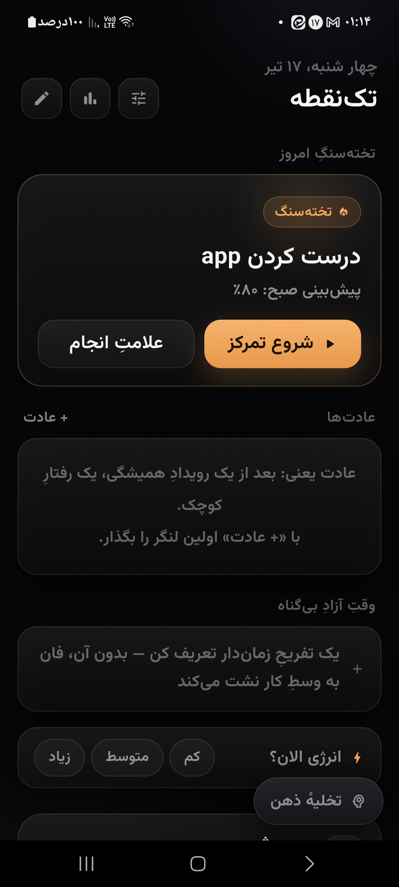
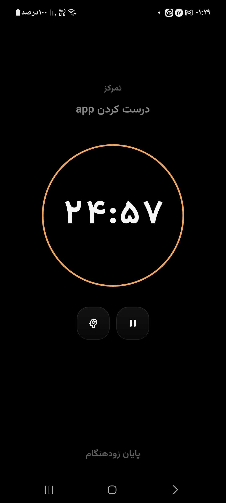
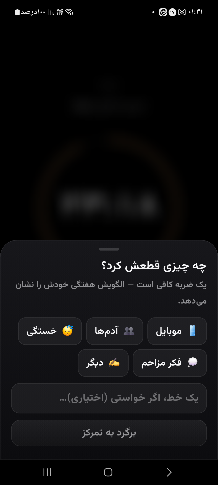
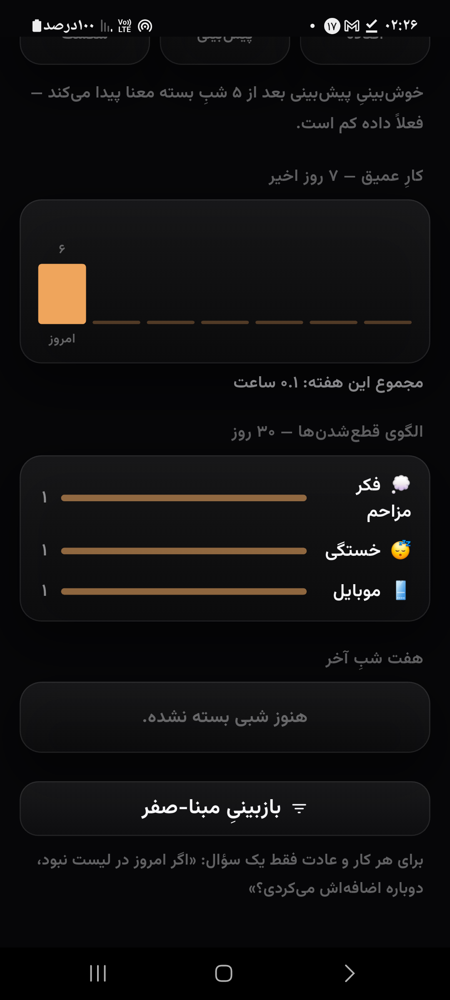

<div align="center">



<br/>

[](https://github.com/re-code-sh/re-flow/actions)
[](https://github.com/re-code-sh/re-flow/releases/latest)
[](https://github.com/re-code-sh/re-flow/releases/latest)
[](https://flutter.dev)
[](#-fork-features--قابلیت‌های-فورک)
[](#)

### **re-flow (تک‌نقطه) — Enhanced Fork**
*A behavioral science-backed daily protocol for deep focus, habits, and self-calibration.*

**[ ⬇️ Download Latest Release (APK) ](https://github.com/re-code-sh/re-flow/releases/latest)** · [Fork Features](#-fork-features--قابلیت‌های-اختصاصی-این-فورک) · [Core Protocol](#-core-protocol--پروتکل-اصلی) · [Build from Source](#-build-from-source--ساخت-از-سورس)

</div>

---

## 🚀 Fork Features / قابلیت‌های اختصاصی این فورک

This repository (**`re-flow`**) is an upgraded, internationalized, and feature-enhanced fork of the original "Flow" (تک‌نقطه) app. Here are the major enhancements added in this fork:

### 🌐 1. Full Internationalization (i18n / L10n)
- **Persian & English Support**: Complete seamless switching between **Persian (RTL)** and **English (LTR)** directly from Settings.
- **Psychological Tone Preservation**: All behavioral science terms are localized into deep English equivalents (*تخته‌سنگ ➔ The Boulder*, *مخزن ذهن ➔ Brain Vault*, *آینه ➔ Stats Mirror*, *شکاف خوش‌بینی ➔ Optimism Gap*).
- **Locale-Aware Formatting**: Automatic digit switching (`۱۲۳` / `123`), clock formatting, and date displays adapt to the selected language.

### 📈 2. Active Days Dynamic Task Capacity Unlocking
- **Non-Punitive Progression**: Daily task slots dynamically unlock based on total completed active days in SQLite — **without punishing missed days** (missing a day never resets progress):
  - **0–14 Active Days**: Max **3 tasks** (1 Boulder + 2 secondary)
  - **15–29 Active Days**: Max **4 tasks** (1 Boulder + 2 secondary + 1 Pebble)
  - **30+ Active Days**: Max **5 tasks** (1 Boulder + 2 secondary + 2 Pebbles) [Hard Cap]
- **"Pebble" (سنگریزه) Identity**: Slots 4 & 5 are specifically designated as Pebbles with helper text: *"Quick win (<15 min low-energy task)" / "کار سریع و کم‌انرژی (زیر ۱۵ دقیقه)"*.
- **Capacity Indicators**: Real-time progress hint and counter in the Morning Setup Wizard and Today screen.

### 📦 3. Automated CI/CD & Multi-ABI Builds
- **Automated GitHub Releases**: Automatically builds universal & split per-ABI APKs (`arm64-v8a`, `armeabi-v7a`, `x86_64`) on git tags (`v*`).
- **Release Keystore Signing**: Integrated GitHub Secrets keystore decoding and signing pipeline.

### 🧪 4. Enhanced Reliability & Code Quality
- **57+ Automated Tests**: Comprehensive test coverage across models, L10n, active days progression, and repository layer.
- **Strict Linting**: Clean static analysis (`flutter analyze`) with zero warnings/errors.

---

## 🧠 Core Protocol / پروتکل اصلی تک‌نقطه

The core behavioral protocol engineered into the app:

| Feature / قابلیت | Description (English) | توضیح (فارسی) |
|---|---|---|
| **🔥 The Boulder (تخته‌سنگ)** | Pick 1 primary goal each morning; secondary tasks queue behind it. | هر صبح ۱ کار اصلی ستاره می‌خورد و بقیه پشت آن صف می‌کشند. |
| **🎯 Prediction (پیش‌بینی)** | Calibrate morning probability % vs night outcome to track the *Optimism Gap*. | پیش‌بینی درصد موفقیت صبح و سنجش آن با واقعیت شب. |
| **⏱ Deep Focus (تمرکز عمیق)** | Crash-proof timer tied to OS wall clock + intruding thought capture (*Brain Vault*). | تایمر مقاوم به کرش مبتنی بر ساعت OS + ثبت سریع افکار مزاحم. |
| **🌱 Recovery Habits (عادت‌ها)** | Anchor cues + friction pause for bad habits. Measures *Recovery Rate* instead of streaks. | فرمول لنگرسازی + اصطکاک عادت بد. سنجش نرخ بازگشت به‌جای streak. |
| **🌙 Night Review (مرور شب)** | 60-second review + 3-Why root cause analysis when The Boulder fails. | مرور ۶۰ ثانیه‌ای شب و تحلیل ۳ «چرا» در صورت عدم موفقیت. |
| **🪞 Stats Mirror (آینه)** | Judgment-free metrics: Win Rate, Optimism Gap, Recovery Rate & Golden Hour energy peak. | آمار بدون قضاوت: نرخ برد، شکاف خوش‌بینی و ساعت طلایی انرژی. |

---

## 📱 Screenshots / پیش‌نمایش

<div align="center">
<table>
<tr>
<td align="center" width="25%"><br/><sub><b>Today / امروز</b></sub></td>
<td align="center" width="25%"><br/><sub><b>Focus / تمرکز</b></sub></td>
<td align="center" width="25%"><br/><sub><b>Interrupts / وقفه</b></sub></td>
<td align="center" width="25%"><br/><sub><b>Stats Mirror / آینه</b></sub></td>
</tr>
</table>
</div>

---

## 🔒 Privacy / حریم خصوصی

- **100% Offline**: No account, no internet required, no servers, no analytics.
- **Local SQLite**: All data stored safely on-device with JSON backup & restore.

---

## 🛠 Build from Source / ساخت از سورس

```bash
git clone https://github.com/re-code-sh/re-flow.git
cd re-flow
flutter pub get
flutter run
```

### 🧪 Run Tests & Analysis
```bash
flutter analyze
flutter test
```

---

## 📄 License & Credits

- Original project by [Mahdi-mortazavi/flow](https://github.com/Mahdi-mortazavi/flow).
- Fork maintained by [re-code-sh/re-flow](https://github.com/re-code-sh/re-flow).
- Open Source under MIT License.
