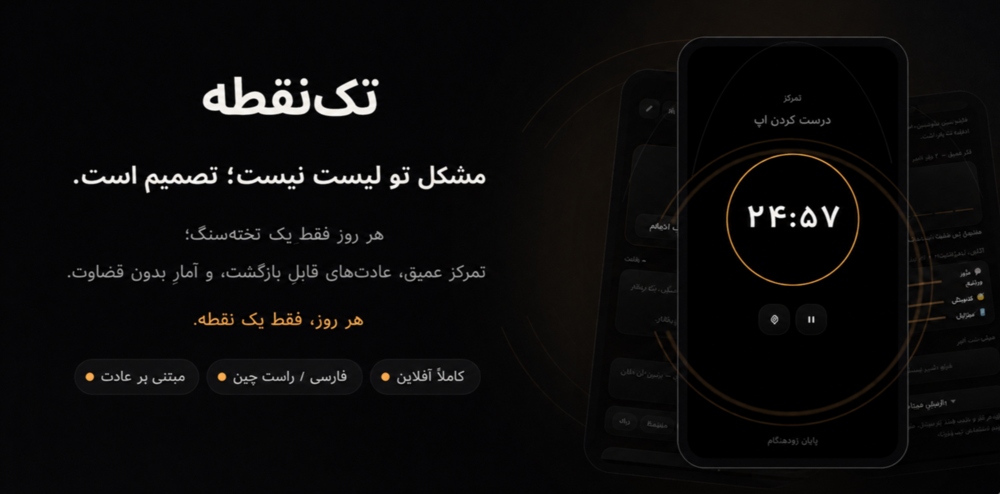

<div align="center">



<br/>

[](https://github.com/Mahdi-mortazavi/flow/actions)
[](https://github.com/Mahdi-mortazavi/flow/releases/latest)
[](https://github.com/Mahdi-mortazavi/flow/releases/latest)
[](https://flutter.dev)
[](#-حریم-خصوصی--مالکیت-داده)
[](#)

### **اپ‌های Todo به تو لیست می‌دهند. مشکلِ تو لیست نیست — تصمیم است.**

*Flow یک Todo-app نیست؛ یک **پروتکل روزانه‌ی مبتنی بر علم رفتار** است که هر روز فقط یک سؤال می‌پرسد:*
### «اگر فقط یک کار امروز انجام شود، کدام است؟»

<br/>

**[ ⬇️ دانلود نسخه‌ی اندروید (APK) ](https://github.com/Mahdi-mortazavi/flow/releases/latest)** · [مشکل](#-مسئله) · [راه‌حل](#-راهحل-تکنقطه) · [چرا ما](#-چرا-flow-برنده-میشود) · [نقشه‌ی راه](#-نقشهی-راه)

</div>

---

## 🎯 در یک جمله

> **Flow (تک‌نقطه)** یک «سیستم‌عاملِ تمرکز» موبایلیِ کاملاً آفلاین است که به‌جای مدیریتِ لیستِ کارها، **رفتارِ روزانه‌ات را مهندسی می‌کند** — یک کارِ ستاره‌دار در روز، تایمرِ تمرکزِ ضدضربه، عادت‌هایی که بعد از شکست برمی‌گردند، و آماری که به‌جای قضاوت، آینه می‌شود.

---

## 📱 پیش‌نمایش

<div align="center">
<table>
<tr>
<td align="center" width="25%"><br/><sub><b>امروز</b><br/>تخته‌سنگ + پیش‌بینی</sub></td>
<td align="center" width="25%"><br/><sub><b>تمرکز</b><br/>رینگ ضدضربه</sub></td>
<td align="center" width="25%"><br/><sub><b>قطع تمرکز</b><br/>ثبتِ یک‌لمسی</sub></td>
<td align="center" width="25%"><br/><sub><b>آینه</b><br/>آمارِ بدونِ قضاوت</sub></td>
</tr>
</table>

<sub>روی دستگاه واقعی (اندروید، RTL فارسی، فونت وزیرمتن) — <a href="docs/screenshots/settings.png">یادآورها و پشتیبان‌گیری</a></sub>

</div>

---

## 🧠 مسئله

هر ابزارِ بهره‌وری‌ای که تا امروز نصب کرده‌ای، یک فرضِ غلط دارد: **«اگر لیستِ بهتری داشته باشی، بهتر عمل می‌کنی.»** اما داده‌ی رفتاری خلافش را می‌گوید. مشکلِ واقعی جای دیگری است:

| نقطه‌ی شکست | چه اتفاقی می‌افتد |
|---|---|
| 🧊 **فلجِ انتخاب** | صبح با ۲۰ کارِ «مهم» شروع می‌کنی؛ مغز زیرِ بارِ انتخاب قفل می‌کند و شب با عذاب وجدان تمام می‌شود. |
| ⛓️ **دام streak** | عادت‌ها با «قدرت اراده» شروع و با اولین شکستِ زنجیره برای همیشه رها می‌شوند. |
| 📱 **نشتِ تمرکز** | وسطِ کارِ عمیق یک فکرِ مزاحم می‌آید؛ نیم‌ساعت بعد در اینستاگرامی. |
| 😔 **تفریحِ گناه‌آلود** | تفریح هیچ‌وقت «مجاز» نیست، پس با احساس گناه به وسطِ کار نشت می‌کند. |
| 🎲 **خودفریبیِ نامرئی** | هیچ‌وقت نمی‌فهمی چقدر خوش‌بینانه برنامه می‌ریزی، چون هیچ‌کس شب ازت حساب نمی‌کشد. |

**نتیجه:** بازارِ اپ‌های Todo اشباع است، اما نرخِ رهاسازیِ (churn) همه‌شان بالاست — چون هیچ‌کدام ریشه‌ی مشکل، یعنی **تصمیم‌گیری و رفتار**، را هدف نگرفته‌اند.

---

## ◉ راه‌حل: تک‌نقطه

Flow مسئله را از سرِ دیگر می‌گیرد. به‌جای «چطور کارهای بیشتری را مدیریت کنیم؟» می‌پرسد **«چطور مطمئن شویم مهم‌ترین کار انجام می‌شود؟»** — و این را به یک پروتکلِ روزانه‌ی کمتر از دو دقیقه‌ای تبدیل می‌کند که هر مرحله‌اش از یک اصلِ اثبات‌شده‌ی علومِ رفتاری ساخته شده.

<table>
<tr>
<td width="50%" valign="top">

### 🔥 تخته‌سنگ (The Boulder)
هر صبح، حداکثر ۳ کار انتخاب می‌کنی و مهم‌ترین را ستاره می‌زنی — این «تخته‌سنگ» توست. بقیه پشتش صف می‌کشند (با راهِ فرارِ آگاهانه، نه دیوار). یک برنده‌ی روشن به‌جای بیست کارِ نیمه‌کاره.

</td>
<td width="50%" valign="top">

### 🎯 پیش‌بینی صادقانه
صبح می‌گویی «چند درصد احتمال دارد تخته‌سنگ بیفتد؟» — شب چک می‌شود. بعد از چند هفته، اپ **شکافِ خوش‌بینی‌ات** را نشان می‌دهد: چند واحد خودت را گول می‌زنی.

</td>
</tr>
<tr>
<td width="50%" valign="top">

### ⏱ تمرکزِ ضدضربه
تایمرِ تمام‌صفحه بر پایه‌ی ساعتِ سیستم — اپ را ببندی، گوشی ری‌استارت شود، تایمر درست می‌ماند و زنگِ پایان روی خودِ OS ثبت است. فکرِ مزاحم آمد؟ بدونِ خروج از تمرکز، دو ثانیه‌ای در **مخزنِ ذهن** رهایش می‌کنی.

</td>
<td width="50%" valign="top">

### 🌱 عادت‌هایی که برمی‌گردند
فرمولِ لنگر «بعد از [X]، [رفتار کوچک]» + یادآور دقیقاً در لحظه‌ی محرک. **بدونِ streakِ تنبیهی.** عددِ قهرمانِ این اپ، **نرخِ بازگشت بعد از شکست** است، نه طولِ زنجیره.

</td>
</tr>
<tr>
<td width="50%" valign="top">

### 🌙 مرورِ شبِ ۶۰ ثانیه‌ای
چکِ نهایی + اگر تخته‌سنگ نیفتاد، زنجیره‌ی «چرا» تا رسیدن به علتِ *سیستمی* — بدون سرزنش. یادگیری همین‌جا اتفاق می‌افتد.

</td>
<td width="50%" valign="top">

### 🪞 آینه
آمارِ بدونِ قضاوت: نرخِ برد، شکافِ خوش‌بینی، نرخِ بازگشت، نمودارِ کارِ عمیقِ هفته، الگوی قطع‌شدن‌ها، و **ساعتِ طلاییِ انرژی‌ات**.

</td>
</tr>
</table>

<details>
<summary><b>+ سه ابزارِ دیگر که چسبندگی می‌سازند</b> (کلیک کنید)</summary>

<br/>

- **🚫 ترکِ عادتِ بد با جایگزینی** — لحظه‌ی وسوسه → ۱۰ ثانیه مکثِ اجباری + هزینه‌ی بلندمدت جلوی چشم + یک دکمه: «به‌جایش: …». همان محرک، پاسخِ جدید. (Friction Engineering)
- **🎮 وقتِ آزادِ بی‌گناه** — تفریح بخشِ رسمیِ برنامه است، زمان‌دار و بی‌عذاب. تا تخته‌سنگ نیفتاده «قفلِ نرم» است؛ بعد از افتادن، پاداشِ شرطیِ روز. (Temptation Bundling)
- **🔍 بازبینیِ مبنا-صفر** — هر هفته برای تک‌تکِ کارها و عادت‌ها فقط یک سؤال: «اگر امروز در لیست نبود، دوباره اضافه‌اش می‌کردی؟»

</details>

---

## 🔄 محصول در عمل: یک روزِ کامل

روزِ کاربرِ Flow یک حلقه‌ی بسته است — هر مرحله ورودیِ مرحله‌ی بعد را می‌سازد:

```
   صبح  ─────────────►  روز  ─────────────►  شب  ─────────────►  هفته
   ┌──────────┐        ┌──────────┐        ┌──────────┐        ┌──────────┐
   │ تخته‌سنگ  │        │  تمرکزِ   │        │  مرورِ    │        │  آینه +  │
   │  + پیش‌   │───────►│  ضدضربه  │───────►│  ۶۰ثانیه │───────►│  بازبینیِ │
   │  بینی %  │        │ + مخزنِ  │        │ + چرا؟   │        │ مبنا-صفر │
   └──────────┘        │   ذهن    │        └──────────┘        └──────────┘
    < ۹۰ ثانیه          └──────────┘         < ۶۰ ثانیه
        │                                         │
        └───────────  یادآورِ هوشمندِ OS  ◄────────┘
              (اگر روز چیده/بسته نشد — وگرنه بی‌صدا رد می‌شود)
```

نتیجه: کاربر هر روز حداقل **یک بار برنده می‌شود**، و اپ بی‌آنکه بار اضافه کند، خودش کاربر را برمی‌گرداند.

---

## 🚀 چرا Flow برنده می‌شود

بازارِ Todo پر است — اما همه در یک محورِ اشتباه رقابت می‌کنند: «امکاناتِ بیشتر». Flow در محورِ دیگری بازی می‌کند: **تغییرِ رفتار.**

| | اپ‌های Todo معمولی | **Flow (تک‌نقطه)** |
|---|:---:|:---:|
| واحدِ اصلی | لیستِ نامحدودِ کار | **یک تخته‌سنگِ روزانه** |
| نگاه به شکست | streakِ شکسته = باخت | **نرخِ بازگشت = بردِ واقعی** |
| برنامه‌ریزی | حدس و امید | **پیش‌بینیِ کالیبره‌شده** |
| تمرکز | تایمرِ درون‌اپی (با کرش می‌پرد) | **مبتنی بر ساعتِ OS، ضدِ کرش** |
| حواس‌پرتی | باید اپ را ببندی | **مخزنِ ذهن، بدونِ خروج** |
| تفریح | بیرونِ سیستم | **پاداشِ رسمیِ درونِ سیستم** |
| آمار | نمودارِ افتخار | **آینه‌ی بدونِ قضاوت** |
| داده | ابر / اکانت / ردیابی | **۱۰۰٪ روی گوشی، بدونِ سرور** |

**دفاعِ محصول (moat):** هر قابلیت به یک اصلِ علومِ رفتاری گره خورده و در قالبِ یک حلقه‌ی روزانه چفت شده. کپی‌کردنِ یک صفحه آسان است؛ کپی‌کردنِ کلِ پروتکل و انسجامِ رفتاری‌اش نیست.

---

## 🔬 علم پشتِ محصول

هر تصمیمِ طراحی، یک منبعِ آکادمیک دارد — این اپ نظرِ شخصی نیست، پیاده‌سازیِ پژوهش است:

| تکنیک | منبع | کجای اپ |
|---|---|---|
| Implementation Intentions | Gollwitzer | فرمولِ عادت + یادآور روی محرک |
| Tiny Habits / قانونِ ۲ دقیقه | BJ Fogg | کوچک‌سازیِ خودکار بعد از شکست |
| Self-compassion بجای streak | Kristin Neff | پیام‌های بازگشت، نرخِ بازگشت |
| Metacognitive Calibration | — | پیش‌بینیِ صبح در برابرِ نتیجه‌ی شب |
| Five Whys | Toyota / Lean | زنجیره‌ی چرا در مرورِ شب |
| Zeigarnik Effect | — | مخزنِ ذهن، حتی وسطِ تمرکز |
| Friction Engineering | — | مکثِ ۱۰ ثانیه‌ای + جایگزینِ یک‌لمسی |
| Zero-based Thinking | — | بازبینیِ هفتگی |
| Temptation Bundling | Katy Milkman | وقتِ آزادِ رسمی |
| Ultradian Rhythm | — | چک‌اینِ انرژی و ساعتِ طلایی |

---

## 📊 وضعیت و بلوغِ محصول

<div align="center">

| نسخه‌ی فعلی | فازهای کامل‌شده | تست‌های خودکار | حریم خصوصی |
|:---:|:---:|:---:|:---:|
| **v0.5.0** | **۳.۶ از ۴** | **۴۳+ در CI** | **۱۰۰٪ آفلاین** |

</div>

Flow یک نمونه‌ی اولیه نیست — یک محصولِ منتشرشده با انضباطِ مهندسیِ جدی است. هر کامیت از **تحلیلِ استاتیکِ سخت‌گیرانه، بررسیِ فرمت و ۴۳+ تستِ خودکار** در CI عبور می‌کند و ریلیزها خودکار ساخته و منتشر می‌شوند. دسترسی‌پذیری جدی گرفته شده: هدف‌های لمسی ≥۴۴px، برچسب‌های اسکرین‌ریدر، و پشتیبانی از فونتِ درشت.

---

## 🔒 حریم خصوصی و مالکیتِ داده

**همه‌چیز فقط روی گوشیِ خودت.** SQLiteِ محلی، بدونِ اکانت، بدونِ سرور، بدونِ آنالیتیکس، بدونِ اینترنت. کدش هم جلوی چشمت است.

- 💾 **پشتیبان‌گیریِ کاملِ JSON** با یک ضربه و بازیابی از فایل
- ↩️ **Undo برای حذف‌ها** — و بازبینیِ هفتگی تا لحظه‌ی تأیید هیچ‌چیز را پاک نمی‌کند
- 🔓 **بدونِ قفل‌شدن** — داده‌ات همیشه قابلِ خروج و در فرمتِ باز است

> در دنیایی که هر اپِ بهره‌وری داده‌ات را می‌فروشد، آفلاین‌بودنِ Flow یک ویژگی نیست — یک **موضع** است.

---

## 🎨 دیزاین — Liquid Glass Ember

بوم تقریباً سیاه (`#060608`)، سطوحِ شیشه‌ایِ مونوکروم، و دقیقاً *یک* رنگِ گرم (کهربایی `#EFA55C`) که فقط به مهم‌ترین چیزِ روز — تخته‌سنگ — تعلق دارد. الهام‌گرفته از زبانِ طراحیِ اپل: سلسله‌مراتب با نور و فاصله، نه با شلوغی. فونت: وزیرمتن (بومی، RTL).

> «یک رنگ برای یک تصمیم» — کلِ فلسفه‌ی محصول در سیستمِ رنگش خلاصه شده.

---

## 📥 نصب

1. از [Releases](https://github.com/Mahdi-mortazavi/flow/releases/latest) فایل `‎.apk` را دانلود کن
2. اجازه‌ی «نصب از منابعِ ناشناس» را بده و نصب کن
3. اجازه‌ی نوتیفیکیشن را تأیید کن (زنگِ پایانِ تمرکز و یادآورِ عادت)

**پیش‌نیاز:** اندروید ۵+ با پردازنده‌ی ۶۴بیتی (arm64-v8a)

---

## 🛠 ساخت از سورس

```bash
git clone https://github.com/Mahdi-mortazavi/flow.git
cd flow
flutter pub get
flutter run
```

**پشته‌ی فنی:** Flutter 3.35 · Riverpod 3 · SQLite (sqflite) · flutter_local_notifications · تقویمِ جلالی (shamsi_date) · فونتِ وزیرمتن

---

## 🗺 نقشه‌ی راه

- [x] **فاز ۱** — تخته‌سنگ، پیش‌بینی، تمرکز، مرورِ شب، مخزنِ ذهن
- [x] **فاز ۲** — عادت‌ها با یادآور روی محرک، ترکِ عادت با جایگزینی، وقتِ آزاد
- [x] **فاز ۳** — آینه، بازبینیِ مبنا-صفر، چک‌اینِ انرژی و ساعتِ طلایی
- [x] **فاز ۳.۵** — حلقه‌ی بازگشت (یادآورِ صبح/شب/هفتگی)، پشتیبان‌گیری و بازیابی، Undo، آیکونِ برند، دسترسی‌پذیری
- [x] **فاز ۳.۶** — ویرایش/حذفِ کار با لمسِ طولانی، چیپ‌های یک‌لمسیِ قطعِ تمرکز + الگوی دسته‌بندی‌شده، قفلِ نرمِ وقتِ آزاد، شرطِ داده برای شکافِ خوش‌بینی، میان‌بُرِ «ثبتِ فکر»
- [ ] **فاز ۴** — ویجتِ صفحه‌ی اصلی، Live Activity، لایه‌ی هویت و ارزش‌ها، DNDِ خودکار

---

<div align="center">

## English

**Flow (Tak-Noghteh, "single point")** is an offline-first, Persian-language **focus & habit OS** for Android — built on behavioral science rather than willpower.

Todo apps hand you a list. But your problem was never the list — it's the **decision**. Flow replaces the infinite backlog with a single daily protocol: one starred **"boulder"** task with a morning success **prediction** (checked honestly at night), a crash-proof wall-clock **focus timer** with an OS-level end alarm, anchor-based **habits** with cue-time actionable notifications, **recovery-rate instead of punishing streaks**, a 10-second **friction pause** with one-tap replacement for breaking bad habits, a 60-second evening **why-chain** review, guilt-free scheduled **fun**, one-tap **energy check-ins** that reveal your golden hour, and a judgment-free stats **mirror**.

Every feature maps to a peer-reviewed behavioral principle, chained into one daily loop that pulls the user back on its own. **100% on-device — no account, no server, no tracking.**

*Built with Flutter · Liquid-glass ember design*

<br/>

**[ ⬇️ Download the latest release ](https://github.com/Mahdi-mortazavi/flow/releases/latest)**

</div>
